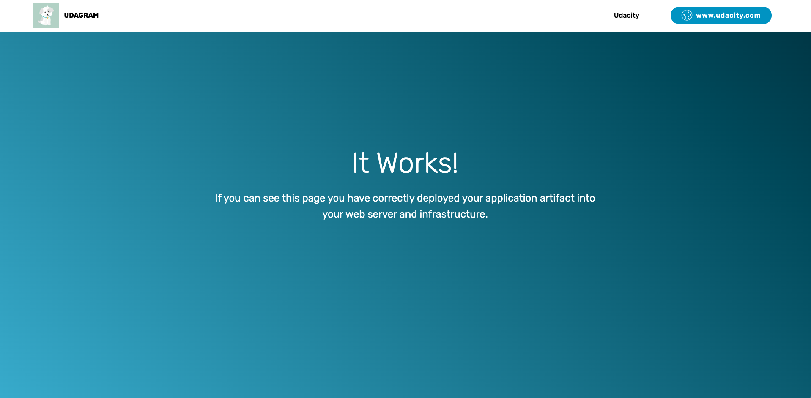
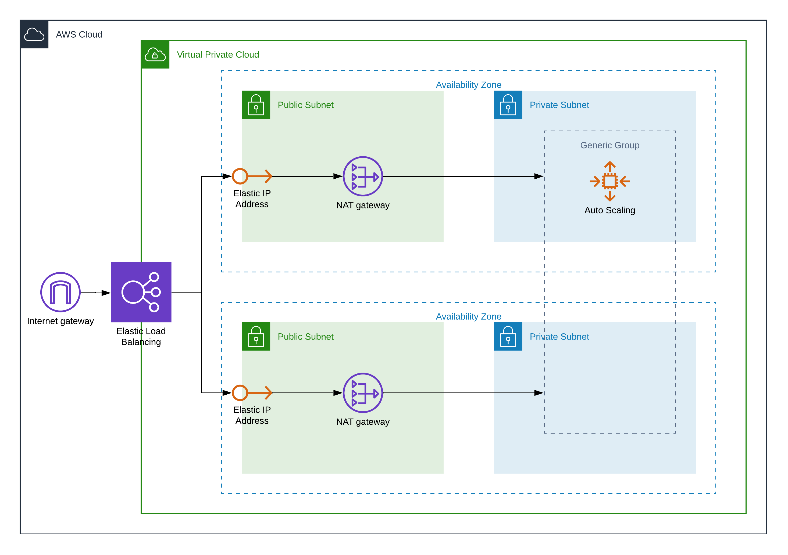

<h1 align="center">
    udacity-cloudformation
</h1>

<p align="center">
    This project is a challenge of <a href="https://www.udacity.com/course/cloud-dev-ops-nanodegree--nd9991">Cloud DevOps Engineer Nanodegree Program</a> from Udacity to create a test environment for the Udagram application using CloudFormation.
</p>


## Udagram



## Getting Started

These instructions will get you a copy of the project up and running on your aws account.

### Prerequisites

* [aws-cli](https://github.com/aws/aws-cli) to interact with CloudFormation.
* [IAM](https://docs.aws.amazon.com/pt_br/IAM/latest/UserGuide/introduction.html) to interact with CloudFormation.

### Deploy

To deploy and test.
```
aws cloudformation create-stack --stack-name udagram --region us-west-2 --template-body file://app.yml --capabilities CAPABILITY_NAMED_IAM
```

## Diagram


